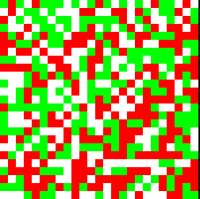

# Cellular Automaton Models

Schelling's Segregation Model and Conways Game of Life visualizations written in Haskell. Potentially more to come.

(Pictured: a visualization of an early stage in Schelling's Segregation Model)

## Dependencies

haskell, ghc, stack

## Running

Change the import in `./app/Main.hs` to `Schelling` or `Conway` to run that model.

To build: `stack build`

To run: `stack exec models-exe`

Both at the same time: `stack build && stack exec models-exe`

## To Dos

- Fix bug in Schelling model replacing white spaces
- Add real randomization
- Fix rendering of small grid boxes (or enforce size limit)
- Change Chars to Data Types
